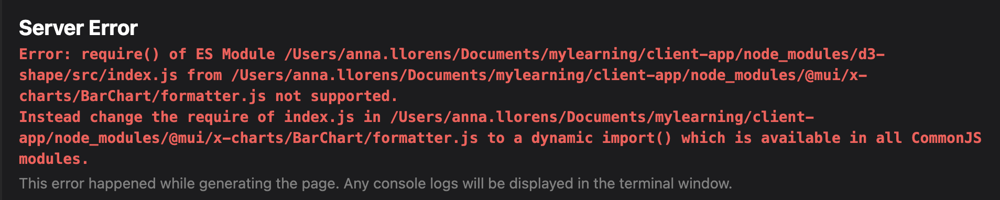

# Managing npm packages

1. Create Next.js repo with Typescript as templated

```bash
  npx create-next-app@latest app-name
```

2. Install yarn dependencies + remove default `package.lock.json`

```bash
yarn
```

3. Add @apollo/client graphql

```bash
yarn add @apollo/client graphql
```

4. Adding styled-components

```bash
yarn add styled-components
```

- Add config to `package.json`

```json
 "resolutions": {
    "styled-components": "^5"
  },
```

- Add babel plugin to compile the styled-components naming

```bash
 yarn add babel-plugin-styled-components --dev
```

- Add babel config in `.babelrc` file at route folder

```json
{
  "presets": ["next/babel"],
  "plugins": [
    [
      "styled-components",
      {
        "ssr": true,
        "displayName": true,
        "preprocess": false
      }
    ]
  ]
}
```

- Add new `_document.tsx` to parse the styled-component css clases

```Typescript
static async getInitialProps(
    ctx: DocumentContext
  ): Promise<DocumentInitialProps> {
    const initialProps = await Document.getInitialProps(ctx);
    const sheet = new ServerStyleSheet();
    const page = ctx.renderPage(
      (App) => (props) => sheet.collectStyles(<App {...props} />)
    );
    const styleTags = sheet.getStyleElement();
    return { ...initialProps, ...page, ...styleTags };
  }
  // ...
    render(): JSX.Element {
    return (
      <Html>
        {/* <Head>{this.props.styleTags}</Head> */}
        <Head>{this.props.styleTags}</Head>
  // ...
```

## 💅 Style Material UI components example

```Typescript
import * as React from 'react';
import Slider, { SliderProps } from '@mui/material/Slider';
import { alpha, styled } from '@mui/material/styles';

const SuccessSlider = styled(Slider)<SliderProps>(({ theme }) => ({
  width: 300,
  color: theme.palette.success.main,
  '& .MuiSlider-thumb': {
    '&:hover, &.Mui-focusVisible': {
      boxShadow: `0px 0px 0px 8px ${alpha(theme.palette.success.main, 0.16)}`,
    },
    '&.Mui-active': {
      boxShadow: `0px 0px 0px 14px ${alpha(theme.palette.success.main, 0.16)}`,
    },
  },
}));

export default function StyledCustomization() {
  return <SuccessSlider defaultValue={30} />;
}
```

## Dynamic imports on Nextjs

To Fix dynamic imports on Next js like:


Update `next.confg.js`

- Add the package to the transpiled modules array list + disable experimentals

```js
const withTM = require("next-transpile-modules")([
  "@mui/x-charts/BarChart",
  "@mui/x-charts/LineChart",
]);
```
